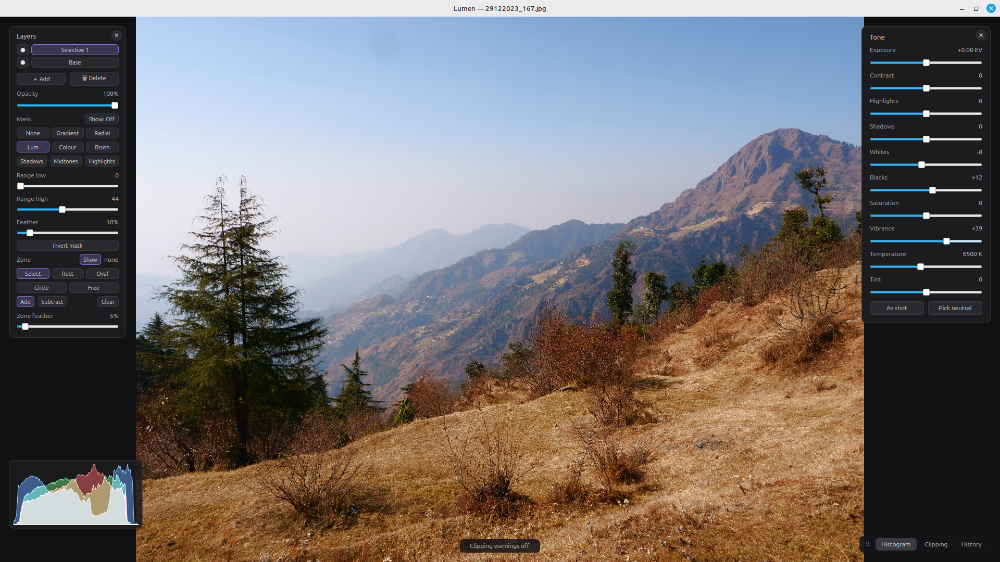

<div align="center">


**A fast, non-destructive photo editor built around an immersive canvas and a command-palette workflow.**

Professional-grade RAW and photo editing for Linux and macOS — a full tone,
colour, detail, and local-adjustment pipeline, GPU-accelerated for real-time
preview, with the photo as the whole world and your keyboard as the controls.



</div>

---

## Why Lumen

Most editors bury your photo under panels, toolbars, and palettes. Lumen inverts
that: the image fills the screen, and everything else is summoned only when you
need it. Press <kbd>/</kbd>, type a few letters of what you want — `expo`,
`curves`, `heal`, `grain` — and go. The guiding principle is simple:

> **Keyboard to navigate and command; pointer to manipulate.**

Under the hood it's a genuine, non-destructive imaging pipeline: RAW files are
demosaiced at 16 bits and carried through a floating-point working space, every
edit is a re-orderable node in an edit graph, and the full-resolution result is
rendered by **libvips** while your interactive preview runs on the **GPU**. Your
original is never touched.

## Features

### Tone & colour

- **Tone** — exposure, contrast, highlights, shadows, whites, blacks, saturation,
  and a saturation-aware vibrance.
- **White balance** — true linear-light, camera-accurate Kelvin/tint correction,
  seeded from the RAW's as-shot values with an eyedropper for neutral picks.
- **Curves** — per-channel and luma tone curves.
- **Colour mixer** — per-band HSL (hue / saturation / luminance) control.
- **Colour grading** — shadow / midtone / highlight colour wheels.
- **Looks** — apply 3D LUT (`.cube`) film and creative looks, with intensity.
- **Monochrome** — channel-weighted black & white with split toning.

### Detail & repair

- **Healing brush** — content-aware inpainting to remove spots and distractions.
- **Sharpen**, **Denoise**, and **Defringe** (chromatic-aberration cleanup).

### Geometry & lens

- **Crop & rotate** — aspect-ratio presets, 90° rotation, and horizontal/vertical
  flips.
- **Lens & perspective** — automatic distortion, TCA, and vignetting correction
  from EXIF via [Lensfun](https://lensfun.github.io/), plus manual perspective.

### Local adjustments

- **Layers** with independent adjustments, opacity, and masks.
- **Masks** — radial, linear-gradient, luminosity-range, colour-range, and
  free-hand brush, all non-destructive.

### Creative

- **Vignette** and **film grain** for finishing.

### Workflow

- **Non-destructive edit graph** with unlimited undo/redo and an adjustment
  history you can step through.
- **Presets** — save a full edit as a reusable `.lumenpreset`, or copy/paste
  settings between photos (<kbd>Ctrl+Shift+C</kbd> / <kbd>Ctrl+Shift+V</kbd>).
- **Projects** — `.lumen` files embed the original plus the full edit; **autosave
  and crash recovery** keep work safe.
- **Live histogram** and clipping warnings.
- **Command palette** (<kbd>/</kbd>) with fuzzy matching over every tool.
- **Thumbnail browser** in the open dialog — real previews for every format,
  RAW included.

### Formats & output

- **Input** — JPEG, PNG, TIFF, WebP, and camera **RAW** (Canon, Nikon, Sony,
  Panasonic, Fujifilm, and more) via [LibRaw](https://www.libraw.org/).
- **Export** — JPEG, PNG, TIFF, WebP with control over quality, 8- or 16-bit
  depth, output resize (long-edge), and **colour management** — sRGB, Display P3,
  or Adobe RGB with the matching ICC profile embedded.

## The interaction model

Lumen is modal, like an editor should be. You live in **Browse** mode — zoom
(wheel), pan (drag), toggle before/after — and drop into a tool only for as long
as you need it. The palette is the hub: it lists every command grouped by
workflow (Tone & Color, Detail & Repair, Crop & Lens, Effects, Selective,
Presets…), and fuzzy subsequence matching means a couple of keystrokes is enough.

Common shortcuts:

| Key | Action |
| --- | --- |
| <kbd>/</kbd> | Command palette |
| <kbd>Ctrl+O</kbd> | Open image · <kbd>Ctrl+Shift+O</kbd> open project |
| <kbd>Ctrl+S</kbd> | Save project |
| <kbd>Ctrl+Z</kbd> / <kbd>Ctrl+Shift+Z</kbd> | Undo / redo |
| <kbd>Ctrl+Shift+C</kbd> / <kbd>Ctrl+Shift+V</kbd> | Copy / paste settings |
| <kbd>Ctrl+0</kbd> | Reset view · <kbd>F11</kbd> fullscreen |

## Under the hood

- **Language / UI** — C++20 and **Qt 6.7+**, rendering through **Qt RHI**
  (Metal on macOS, Vulkan/OpenGL on Linux) for a real-time, GPU-accelerated
  preview.
- **Imaging** — **libvips** for the full-resolution, memory-efficient pipeline
  and export; **LibRaw** for RAW decoding.
- **Colour** — a floating-point sRGB working space with highlight headroom;
  optional **Little CMS (lcms2)** drives wide-gamut export.
- **Architecture** — a UI-free `lumen_core` library (image pipeline, edit graph,
  layers, serialization) sitting beneath the Qt front-end, so the imaging code is
  independently unit-tested.

## Installing

Lumen is installed from source on both Linux and macOS — see
[Building](#building) for the one-command script. There are no pre-built
downloads, by choice rather than omission: Lumen leans on libvips, LibRaw, and
Lensfun, and building against the copies your machine already has is what keeps
lens profiles current and the corrections working. A bundle has to pin whatever
the build machine shipped, which is how the v0.1.0 AppImage came to have lens
corrections that silently did nothing.

## Building

### From source, in one command

Clone the repo and run the bootstrap script — it installs the dependencies
(imaging libraries, toolchain, and Qt 6.7+), then builds and installs Lumen:

```bash
git clone https://github.com/vijaymathew/lumen.git
cd lumen
./install.sh
```

Or, if you prefer `make`:

```bash
make            # install deps, build, and install to /usr/local
make build      # configure + build only (deps already present)
make test       # build, then run the test suite
```

That's the whole thing. Useful `install.sh` flags:

```bash
./install.sh --prefix ~/.local   # install somewhere other than /usr/local
./install.sh --no-deps           # dependencies already present; just build + install
./install.sh --qt-dir /path/to/Qt/6.7.2/gcc_64   # use a specific Qt
```

On Linux it uses `apt`, `dnf`, or `pacman` for the imaging libraries plus the
OpenGL/xcb libraries Qt links against; on macOS it uses Homebrew. When the
system Qt is older than 6.7 (common on Linux), it fetches Qt 6.7+ into `.qt/`
via [aqtinstall](https://github.com/miurahr/aqtinstall) automatically — that
fallback needs `python3` and `pip`, or you can point at an existing Qt with
`--qt-dir`. Prefer to wire everything up by hand? The manual steps are below.

### Requirements

- CMake ≥ 3.24 and a C++20 compiler
- **Qt 6.7+** — Core, Gui, Widgets, Concurrent, ShaderTools (6.7 is required for
  `QRhiWidget`)
- **libvips** with the C++ bindings (`vips-cpp`)
- **LibRaw** (`libraw`)
- Optional: **Lensfun** (automatic lens correction) and **lcms2** (wide-gamut
  export colour management) — features degrade gracefully when absent.

### Manual build — Linux

Distro Qt is often older than 6.7. Install Qt 6.7+ (e.g. via
[aqtinstall](https://github.com/miurahr/aqtinstall) or the Qt online installer),
or use your distro's package if it is new enough. The imaging libraries come from
the system:

```bash
sudo apt-get install -y libvips-dev libraw-dev liblensfun-dev liblcms2-dev ninja-build

cmake -S . -B build -G Ninja -DCMAKE_BUILD_TYPE=RelWithDebInfo
cmake --build build --parallel
./build/lumen path/to/photo.raf
```

If Qt is in a non-standard location, point CMake at it:
`-DCMAKE_PREFIX_PATH=/path/to/Qt/6.7.2/gcc_64`.

### Manual build — macOS

```bash
brew install vips libraw lensfun little-cms2 ninja
# Qt 6.7+ via brew (`brew install qt`) or aqt/the online installer.

cmake -S . -B build -G Ninja -DCMAKE_BUILD_TYPE=RelWithDebInfo \
      -DCMAKE_PREFIX_PATH="$(brew --prefix qt)"
cmake --build build --parallel
./build/lumen.app/Contents/MacOS/lumen path/to/photo.jpg
```

CI ([.github/workflows/ci.yml](.github/workflows/ci.yml)) builds both Linux and
macOS on every push.

### Tests

The build also produces the unit-test executables; run them with CTest:

```bash
cmake --build build --parallel                 # rebuild first
ctest --test-dir build                         # whole suite
ctest --test-dir build --output-on-failure     # show output on failure
ctest --test-dir build -R crop                 # only tests matching a name
```

The suite covers the **UI-free core** (`lumen_core`) — the image pipeline, edit
graph, tone/curves/colour nodes, crop/vignette, RAW options, masks, layers,
presets, serialization, export, and autosave. The interactive UI is verified by
running the app.

## Project layout

```
src/
  core/   The UI-free imaging engine (lumen_core): Image (libvips) & RawLoader
          (LibRaw), the EditGraph / Layer / EditNode model, and every edit node
          — Tune, Curves, ColorMixer, ColorGrade, Lut, Mono, Grain, Vignette,
          Sharpen, Denoise, Defringe, Heal, LensCorrection — plus masks,
          histogram, projects, presets, and autosave.
  gpu/    CanvasWidget — the QRhiWidget preview, with GLSL shaders that replicate
          the pointwise pipeline for a real-time GPU render.
  input/  InputController (modal state machine) and the fuzzy CommandPalette.
  ui/     MainWindow (the immersive shell + command routing) and the per-tool
          panels, gizmos, and the thumbnailed open dialog.
docs/     DESIGN.md — the full design document.
```

## License

Lumen is released under the [Apache License 2.0](LICENSE).
